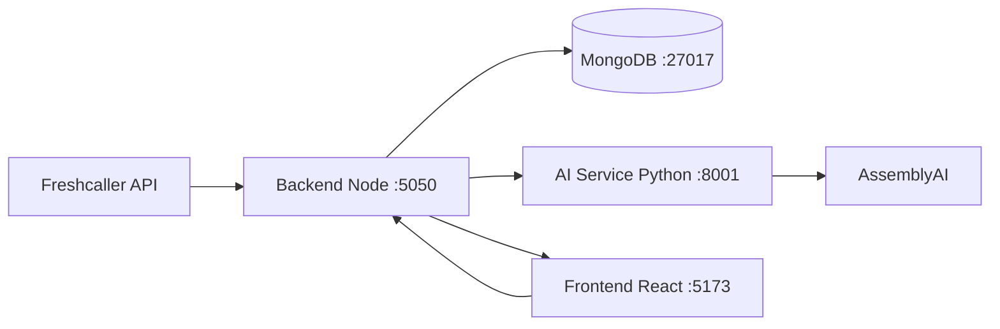

# Architecture

## System context



## Services

| Service | Stack | Port | Responsibility |
| --- | --- | --- | --- |
| **frontend** | React, Vite | 5173 | UI: recordings, agents, sync, logs |
| **backend** | Express, TypeScript | 5050 | API, Freshcaller sync, analysis orchestration |
| **ai-service** | FastAPI, Python | 8001 | Audio analyze: STT, sentiment, extraction, scoring |
| **mongo** | Docker mongo:7 | 27017 | Database `voice_analysis` |

## Key backend modules

| Path | Role |
| --- | --- |
| `backend/src/freshcaller/` | Client, daily sync pipeline, cron |
| `backend/src/db/` | Mongo connection, agents, listings |
| `backend/src/routes/` | REST: recordings, agents, sync |
| `backend/src/scoring/` | Quarter windows, call quality, performance fill |
| `backend/src/services/analyzeRecording.ts` | Download → normalize → AI → persist |
| `backend/src/voicemail.ts` | Connect / voicemail classification rules |

## Key AI service modules

| Path | Role |
| --- | --- |
| `ai-service/app/providers/assemblyai.py` | STT, LLM sentiment, LLM extraction |
| `ai-service/app/analytics.py` | Call quality, speaker metrics, timeline |
| `ai-service/app/participant_performance.py` | Seven-category agent scoring |

## File storage (local)

| Directory | Content |
| --- | --- |
| `backend/data/fc-recordings/` | Downloaded Freshcaller audio |
| `backend/data/exports/` | Export ZIP files |
| `backend/data/normalized/` | 16 kHz mono WAV for analysis |
| `backend/data/uploads/` | Manual uploads (legacy flow) |

## Analysis pipeline (single call)

```
recording in Mongo
  → ensure local audio (download if needed)
  → ffmpeg normalize (worker thread) → 16 kHz mono
  → POST ai-service /analyze
      → AssemblyAI STT + diarization (A/B)
      → ECAPA Stage 3b speaker validation (required; SpeechBrain default)
      → map speakers → Agent/Customer (+ bot tags when applicable)
      → LLM + analytics/scoring
  → store analysisResult, analysisStatus=completed
  → refresh agent stats + listing projection
```

Emergency: set `AUDIO_SPEAKER_VALIDATION=false` on the AI service to skip Stage 3b.
## Timezone

- **Business calendar**: Asia/Kolkata for call dates, quarters, cron.
- **Storage**: ISO timestamps on recordings; `callDate` as `YYYY-MM-DD` IST.

## Environment

See root `README.md` for `ASSEMBLYAI_API_KEY`, `FRESHCALLER_*`, `MONGODB_URI`.
